<p align="center"></p>

<h1 align="center">MoniFit</h1>
<p align="center"><strong>Entrenamiento y nutrición</strong></p>

Aplicación para que **Moni** dé seguimiento completo a sus clientes: cuestionario de ingreso (onboarding),
medidas, composición corporal, progreso de recomposición, rutinas de ejercicio y plan de nutrición mensual.
Cada cliente tiene su propio acceso para consultar **solo su información** y descargar su plan del mes.

---

## Contenido

1. [¿Quién puede hacer qué?](#1-quién-puede-hacer-qué)
   - [1.1 ¿Qué información captura cada quien?](#11-qué-información-captura-cada-quien)
2. [Entrar por primera vez (Moni)](#2-entrar-por-primera-vez-moni)
   - [Primeros pasos: lista para empezar](#primeros-pasos-lista-para-empezar)
3. [Guía para Moni, paso a paso](#3-guía-para-moni-paso-a-paso)
   - [3.1 Dar de alta a un cliente](#31-dar-de-alta-a-un-cliente)
   - [3.2 Darle acceso a la app](#32-darle-acceso-a-la-app)
   - [3.3 Registrar medidas con cinta (antropometría)](#33-registrar-medidas-con-cinta-antropometría)
   - [3.4 Registrar composición corporal](#34-registrar-composición-corporal)
   - [3.5 Ver el progreso (recomposición)](#35-ver-el-progreso-recomposición)
   - [3.6 Asignar una rutina](#36-asignar-una-rutina)
   - [3.7 Crear y editar rutinas y ejercicios](#37-crear-y-editar-rutinas-y-ejercicios)
   - [3.8 Plan de nutrición mensual](#38-plan-de-nutrición-mensual)
   - [3.9 Cambios y bajas de clientes](#39-cambios-y-bajas-de-clientes)
   - [3.10 Tu cuenta y tu contraseña](#310-tu-cuenta-y-tu-contraseña)
   - [3.11 Avisos por Telegram](#311-avisos-por-telegram)
4. [Guía para los clientes](#4-guía-para-los-clientes)
   - [4.1 Tu primer ingreso](#41-tu-primer-ingreso)
   - [4.2 Qué encuentras en la app](#42-qué-encuentras-en-la-app)
   - [4.3 Registrar tu semana](#43-registrar-tu-semana-cada-domingo-1-minuto)
   - [4.4 Activar los avisos por Telegram](#44-activar-los-avisos-por-telegram-opcional)
   - [4.5 Descargar tu plan del mes](#45-descargar-tu-plan-del-mes)
   - [4.6 Tener MoniFit en tu celular como una app](#46-tener-monifit-en-tu-celular-como-una-app)
   - [4.7 Tu cuenta y tu contraseña](#47-tu-cuenta-y-tu-contraseña)
   - [4.8 Pequeño glosario](#48-pequeño-glosario)
5. [Rutina de trabajo recomendada para Moni](#5-rutina-de-trabajo-recomendada-para-moni)
6. [Preguntas frecuentes](#6-preguntas-frecuentes)
7. [Privacidad y seguridad](#7-privacidad-y-seguridad)
8. [Información técnica (instalación y mantenimiento)](#8-información-técnica-instalación-y-mantenimiento)
9. [Publicar en la nube (Oracle Cloud gratis + moni-fit.com)](#9-publicar-en-la-nube-oracle-cloud-gratis--moni-fitcom)

---

## 1. ¿Quién puede hacer qué?

| | **Moni (administradora)** | **Cliente** |
|---|---|---|
| Dar de alta, modificar y dar de baja clientes | ✅ | — |
| Crear, restablecer o desactivar el acceso de un cliente | ✅ | — |
| Registrar medidas y composición corporal | ✅ | — |
| Crear, editar y asignar rutinas y ejercicios | ✅ | — |
| Generar el plan de nutrición mensual | ✅ | — |
| Ver el expediente de **todos** los clientes | ✅ | — |
| Ver **su propio** resumen, rutina, progreso y plan de nutrición | — | ✅ |
| Registrar cómo le fue cada semana con su plan de nutrición | ✅ | ✅ |
| Exportar el plan mensual a PDF o Excel | ✅ | ✅ (solo el suyo) |
| Cambiar su propia contraseña | ✅ | ✅ |
| Conectar el bot de Telegram y enviar mensajes a clientes | ✅ | — |
| Recibir avisos por Telegram (opcional) | ✅ | ✅ |

Un cliente **nunca** puede ver la información de otro cliente, aunque intente escribir la dirección a mano:
la aplicación revisa quién eres en cada pantalla y en cada acción.

### 1.1 ¿Qué información captura cada quien?

**Casi todo lo captura Moni.** El cliente solo crea su contraseña, acepta el aviso de privacidad y, una vez a la
semana, registra cómo le fue con su plan. Todo lo demás lo ve, pero no lo edita.

| Información | ¿Quién la captura? | ¿Cuándo? | Dónde |
|---|---|---|---|
| Cuestionario de ingreso (salud, hábitos, alimentación, objetivo) | **Moni**, en la entrevista con el cliente | Al dar de alta | *Clientes → + Nuevo cliente* |
| Correo de acceso del cliente | **Moni** | Al darle acceso | *Editar perfil y acceso* |
| Medidas con cinta (brazo, pierna, cintura…) | **Moni** | Cada 2–4 semanas | Pestaña *Antropometría* |
| Peso, % de grasa, % de músculo, grasa visceral | **Moni** (báscula) | Cada 2–4 semanas | Pestaña *Composición corporal* |
| Rutina | **Moni** | Al inicio y cuando haya que cambiarla | Pestaña *Rutinas* |
| Plan de nutrición | **Moni** (la app lo calcula) | Cada mes | Pestaña *Nutrición* |
| Su propia contraseña | **Cliente** | Primer ingreso (y cuando quiera cambiarla) | *Mi cuenta* |
| Aceptación del aviso de privacidad | **Cliente** | Primer ingreso, una sola vez | Se le pide al entrar |
| **Seguimiento semanal** | **Cliente** (o Moni por él) | **Cada semana**, de preferencia el domingo | *Mi nutrición → Seguimiento semanal* |
| Vincular Telegram | **Cliente** (opcional) | Cuando quiera | *Mi cuenta → Avisos por Telegram* |

#### El seguimiento semanal: lo único que llena el cliente con regularidad
| Campo | ¿Obligatorio? | Qué escribir |
|---|---|---|
| **Fecha** | Sí (ya viene con la de hoy) | El día en que registra. |
| **Adherencia al plan (%)** | **Sí** | Qué tanto siguió el plan esa semana, de 0 a 100. Forma fácil de calcularlo: *comidas que hizo como decía el plan ÷ comidas del plan en la semana × 100*. Ejemplo: con 4 comidas al día son 28 en la semana; si cumplió 21, su adherencia es **75 %**. |
| **Agua promedio (L)** | No | Litros de agua al día, en promedio. Ejemplo: 2.5. |
| **Energía (1–5)** | No | Cómo se sintió de energía: 1 = muy cansado, 3 = normal, 5 = con mucha energía. |
| **Hambre (1–5)** | No | Cuánta hambre tuvo con el plan: 1 = nada, 3 = normal, 5 = mucha hambre todo el día. |
| **Notas** | No | Lo que Moni deba saber: un evento social, una molestia, un alimento que no le cayó bien. |

> **Por qué importa:** con la adherencia y el cambio de peso, la app ajusta automáticamente las calorías del plan
> del mes siguiente. Si un cliente no registra su semana, el plan no se puede ajustar bien. Por eso, si tiene
> Telegram vinculado, el domingo le llega un recordatorio.

---

## 2. Entrar por primera vez (Moni)

1. Abre **https://moni-fit.com** en el navegador de tu computadora o de tu celular.
2. Verás la pantalla rosa de **Iniciar sesión**.
3. Escribe tu correo **monica@moni-fit.com** y la **contraseña temporal** que te entregaron.

<p align="center">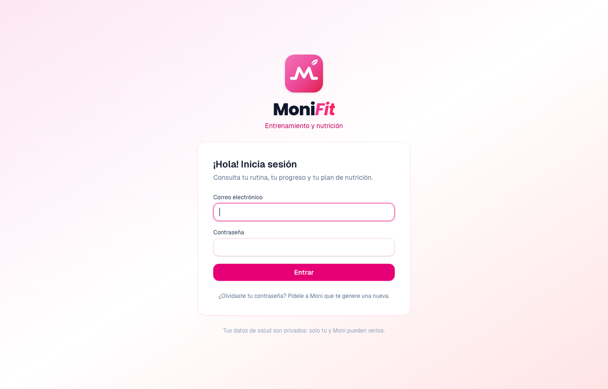</p>

4. La app te pedirá crear **tu propia contraseña** (mínimo 8 caracteres). Escribe primero la temporal,
   luego tu nueva contraseña dos veces y presiona **Guardar y continuar**.

<p align="center">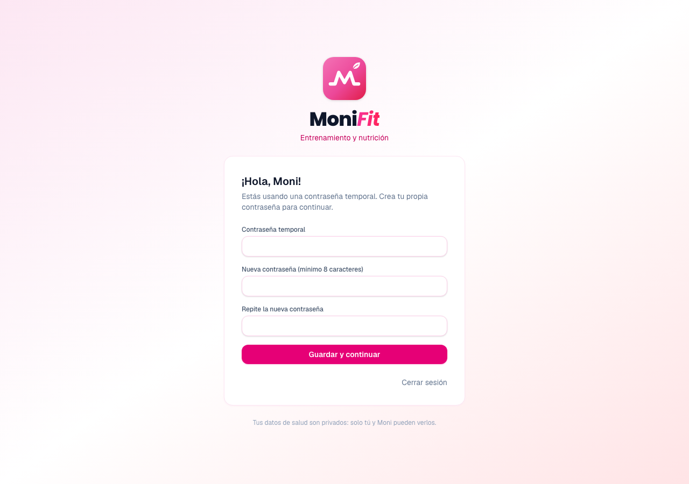</p>

5. Listo: entras a tu panel de **Clientes**.

> 💡 Usa una contraseña que solo tú conozcas. Nadie (ni quien instaló la app) puede verla: la aplicación
> solo guarda una versión cifrada.

### Tu pantalla principal

- **Barra rosa de la izquierda:** menú con *Clientes*, *Rutinas*, *Ejercicios* y *Avisos*. Abajo aparece tu
  nombre, el enlace **Mi cuenta** y el botón **Salir**.
- **Clientes:** una tarjeta por cliente con su objetivo, peso actual, % de grasa, rutina asignada y si
  tiene o no acceso a la app.

<p align="center">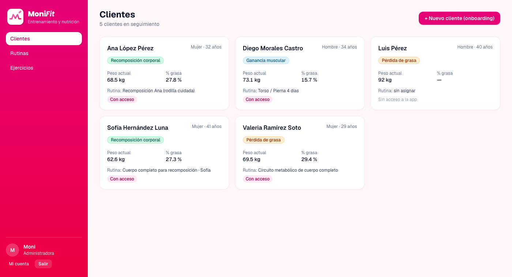</p>

### Primeros pasos: lista para empezar
Una sola vez, en este orden:
- [ ] **Crear tu contraseña** (pasos de arriba).
- [ ] **Conectar el bot de Telegram** y vincular tu propio Telegram, para enterarte cuando tus clientes registren
      su semana ([sección 3.11](#311-avisos-por-telegram), 5 minutos).
- [ ] **Explorar a los clientes de demostración** (abajo), para ver cómo se ve todo con datos.
- [ ] **Dar de alta a tu primer cliente real** con el cuestionario ([3.1](#31-dar-de-alta-a-un-cliente)).
- [ ] **Darle acceso a la app** y enviarle su correo, su contraseña temporal y el enlace a la
      [guía para clientes](#4-guía-para-los-clientes) ([3.2](#32-darle-acceso-a-la-app)).
- [ ] **Registrar sus medidas y composición**, **asignarle rutina** y **generar su plan** ([3.3 a 3.8](#33-registrar-medidas-con-cinta-antropometría)).
- [ ] Cuando ya no los necesites, **eliminar los clientes de demostración**.


### Clientes de demostración

Para que puedas explorar la app desde el primer día, vienen cargados **3 clientes ficticios**, con 3 meses de
medidas, rutina asignada, plan de nutrición del mes anterior con su seguimiento y plan del mes en curso:

| Cliente (ficticio) | Objetivo | Qué muestra |
|---|---|---|
| **Valeria Ramírez Soto** (29 años) | Pérdida de grasa | Bajó de peso más lento de lo esperado: el plan del mes restó 150 kcal de forma automática. |
| **Sofía Hernández Luna** (41 años) | Recomposición corporal | Peso casi igual, pero menos grasa y más músculo. Tiene intolerancia a la lactosa, hipotiroidismo y una rutina **personalizada** por su tendinitis. |
| **Diego Morales Castro** (34 años) | Ganancia muscular | Sube de peso al ritmo esperado; alergia a las nueces. |

Cada uno tiene también acceso al portal de clientes (correos `…demo@monifit.app`), para que veas lo que ve un
cliente. Cuando ya no los necesites, elimínalos desde **Editar perfil y acceso → Eliminar cliente**, o pide
que se ejecute `npm run demo -- --borrar`. Los clientes reales nunca se tocan.

---

## 3. Guía para Moni, paso a paso

### 3.1 Dar de alta a un cliente

1. En **Clientes**, presiona **+ Nuevo cliente (onboarding)**.
2. Llena el cuestionario. Está dividido en secciones:
   - **I. Datos personales y biometría inicial:** nombre, edad, sexo, peso, estatura y **objetivo principal**
     (pérdida de grasa, ganancia muscular, recomposición corporal o rendimiento).
   - **II. Historial médico y salud:** enfermedades, medicamentos, cirugías o lesiones, fracturas y digestión.
   - **III. Perfil hormonal:** aparece solo si eliges *Mujer* (ciclo, síntomas, anticonceptivos, embarazos).
   - **IV. Estilo de vida y descanso**, **V. Nutrición e hidratación**, **VI. Actividad física actual** y
     **VII. Aspectos psicológicos**.
3. Solo **nombre, sexo y objetivo** son obligatorios; lo demás puedes completarlo después.
4. Presiona **Registrar cliente**. Se abre su **expediente**.

<p align="center">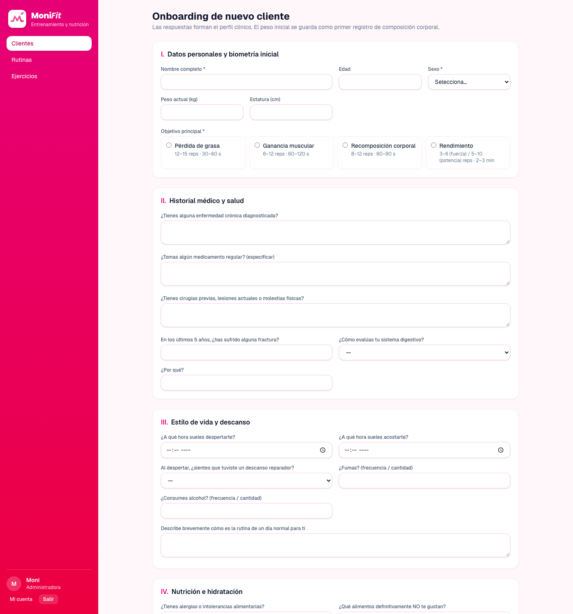</p>


> El peso que escribas se guarda automáticamente como su **primer registro de composición corporal**.

**Lo que conviene llenar bien:** alergias, alimentos que no le gustan, fruta favorita, cuántas comidas hace
al día y si se le dificulta cocinar. Con esas respuestas se arma su plan de nutrición. Las enfermedades,
medicamentos y lesiones aparecen como **alertas amarillas** en su perfil y en sus rutinas.

#### El expediente del cliente

Tiene estas pestañas:

| Pestaña | Para qué sirve |
|---|---|
| **Perfil clínico** | Todas las respuestas del cuestionario, alertas de salud y los parámetros de entrenamiento de su objetivo. |
| **Antropometría** | Medidas con cinta métrica. |
| **Composición corporal** | Peso, % de grasa, % de músculo y grasa visceral. |
| **Recomposición** | Tablero con gráficas y diagnóstico de su progreso. |
| **Rutinas** | Su rutina activa, las recomendadas para su objetivo y su historial. |
| **Nutrición** | Su plan mensual, el seguimiento semanal y el historial de planes. |

Arriba a la derecha está el botón **Editar perfil y acceso**.

<p align="center">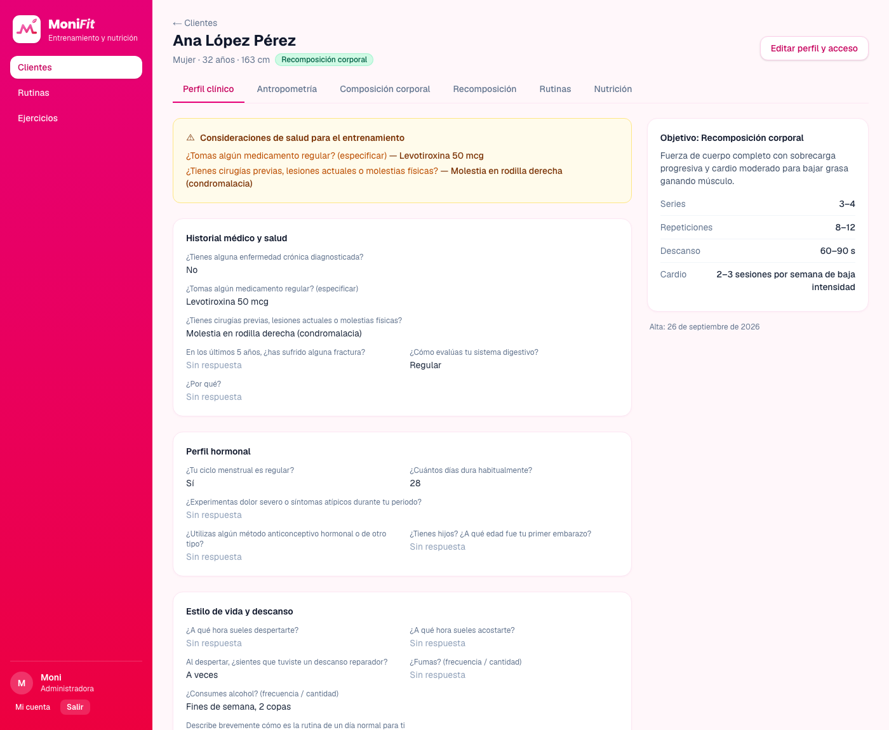</p>


### 3.2 Darle acceso a la app

Mientras un cliente no tenga acceso, su perfil muestra el aviso *"aún no puede entrar a la app"*.

<p align="center">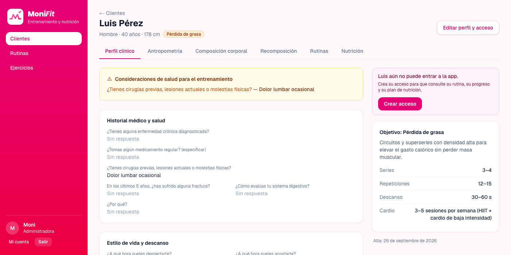</p>


1. Entra al expediente del cliente → **Editar perfil y acceso** (o presiona **Crear acceso** en el aviso).
2. En la sección **Acceso a la aplicación**, escribe el **correo del cliente** y presiona **Crear acceso**.

<p align="center">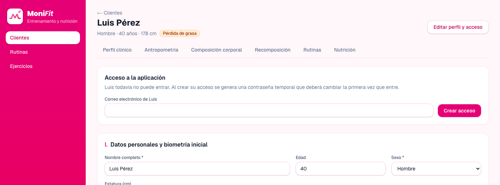</p>

3. Aparece un recuadro verde con una **contraseña temporal** (por ejemplo `fresa-luna-4821`).
   **Cópiala en ese momento**: por seguridad no se vuelve a mostrar.

<p align="center">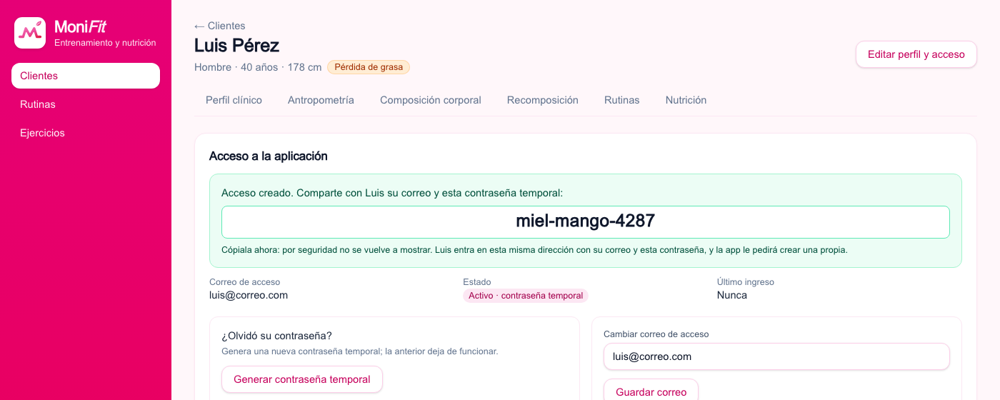</p>

4. Envíale al cliente:
   - la dirección de la aplicación,
   - su correo,
   - la contraseña temporal.
5. La primera vez que entre, la app le pedirá crear su propia contraseña y aceptar el aviso de privacidad.

**Mensaje sugerido para enviarle** (por WhatsApp o correo):
> ¡Hola! Ya tienes acceso a **MoniFit**, donde verás tu rutina, tu progreso y tu plan de nutrición.
> 1. Entra a **https://moni-fit.com**
> 2. Correo: *(su correo)*
> 3. Contraseña temporal: *(la que te mostró la app)*. Te pedirá crear la tuya.
>
> Cada domingo registra en *Mi nutrición → Seguimiento semanal* cómo te fue. Si quieres recibir avisos en
> Telegram, actívalos en *Mi cuenta*. Aquí tienes la guía paso a paso:
> https://github.com/cj-developers-qro/monica-app#4-guía-para-los-clientes
> Cualquier duda, aquí estoy. 💪

En esa misma sección puedes ver el **estado** del acceso (activo, con contraseña temporal o desactivado) y la
fecha de su **último ingreso**.

<p align="center">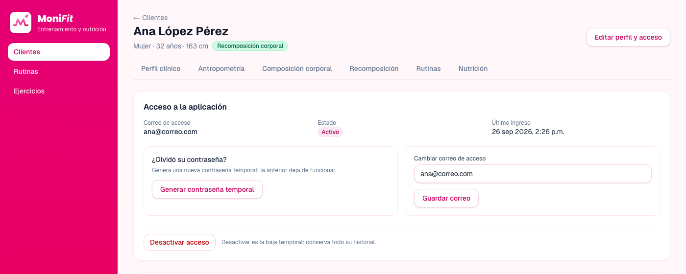</p>


### 3.3 Registrar medidas con cinta (antropometría)

1. Expediente → pestaña **Antropometría**.
2. Escribe la fecha y las medidas en **centímetros**: brazo izquierdo y derecho, pierna izquierda y derecha,
   pantorrilla izquierda y derecha, cintura, cuello y cadera. No es obligatorio llenarlas todas.
3. Presiona **Guardar medidas**.

La pantalla calcula dos indicadores de salud:
- **Índice cintura / cadera:** se considera riesgo elevado arriba de 0.85 en mujeres y 0.90 en hombres.
- **Índice cintura / estatura:** lo deseable es mantenerlo por debajo de 0.5.

Con dos o más registros aparece la gráfica de cintura, cadera y cuello, y una fila de **Cambio total**.
Para borrar un registro equivocado usa **Eliminar** en su renglón.

<p align="center">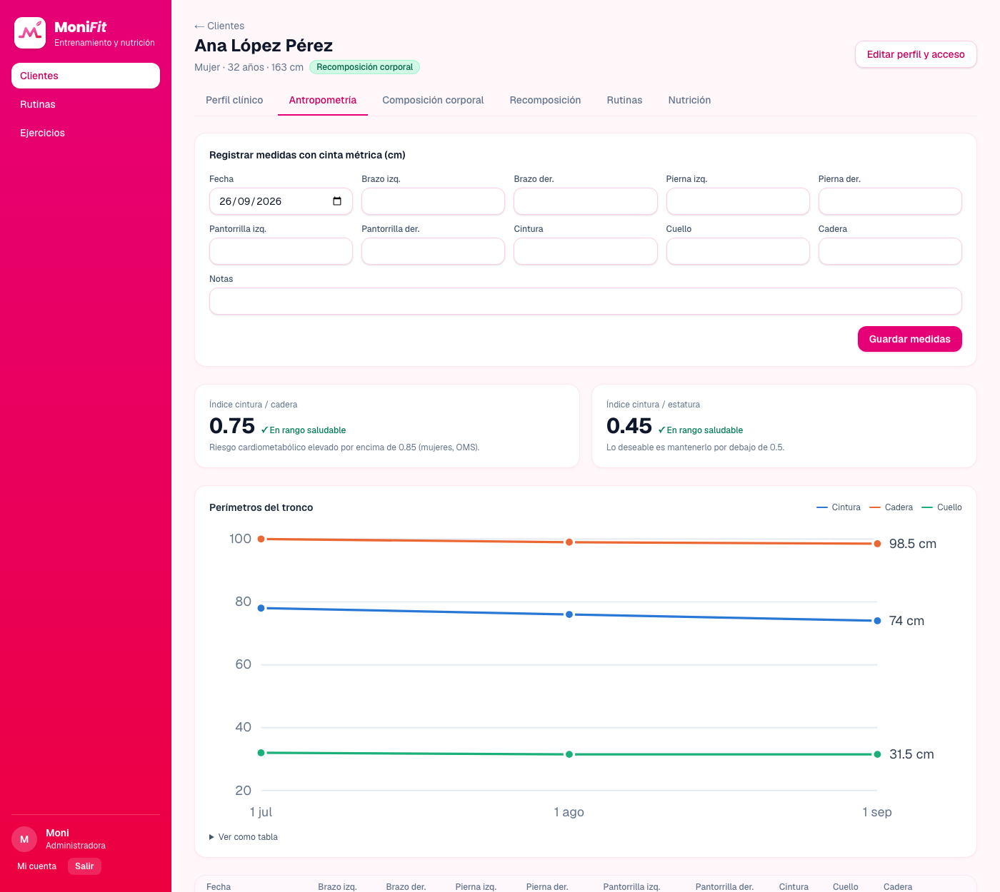</p>


### 3.4 Registrar composición corporal

1. Expediente → pestaña **Composición corporal**.
2. Escribe fecha, **peso** (obligatorio), estatura, **% de grasa corporal**, **% de masa muscular** y el
   **nivel de grasa visceral**, tal como te los da la báscula de bioimpedancia.
3. Presiona **Guardar registro**.

La tabla calcula el **IMC** y convierte los porcentajes a **kilos de grasa** y **kilos de músculo**.

<p align="center">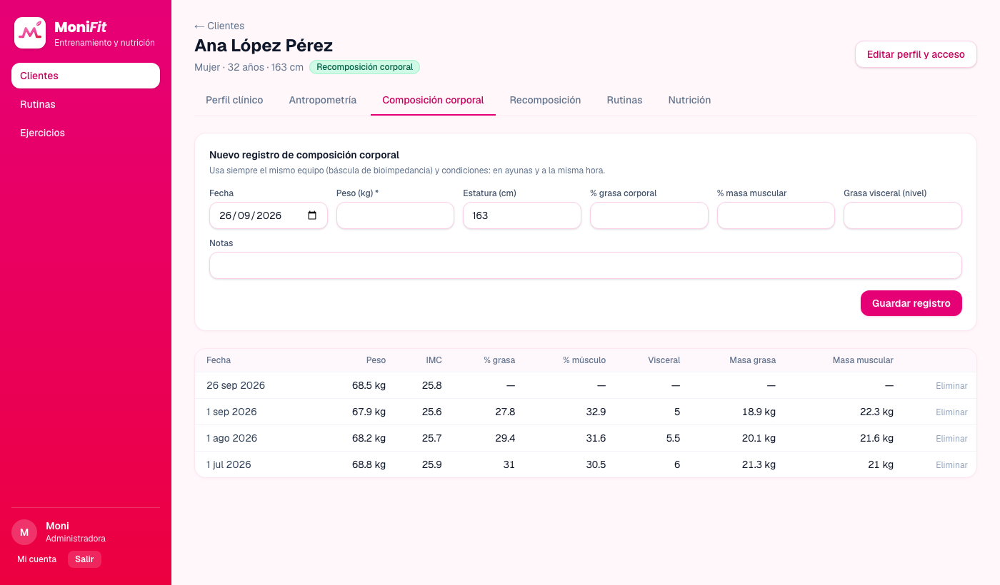</p>


> 💡 Para que las comparaciones sean confiables, mide siempre con la misma báscula, en ayunas y a la misma hora.

### 3.5 Ver el progreso (recomposición)

Expediente → pestaña **Recomposición**. Necesita al menos **dos registros con % de grasa y % de músculo**.

- **Recuadro de diagnóstico** (verde, ámbar o rojo), por ejemplo:
  - *Recomposición corporal lograda* — bajó grasa y subió músculo.
  - *Pérdida de grasa preservando músculo*.
  - *Pérdida de grasa con pérdida muscular* — conviene revisar proteína y rutina.
  - *Ganancia muscular con aumento de grasa*.

  Además indica si el progreso **va alineado con su objetivo**.
- **Tres tarjetas:** cambio de peso, de masa grasa y de masa muscular, en kilos.
- **Gráficas:** masa grasa contra masa muscular, peso corporal y porcentajes. Al pasar el cursor por una gráfica
  ves los valores de cada fecha, y con **Ver como tabla** ves los números exactos.

> La báscula puede marcar casi lo mismo mientras el cuerpo cambia: la gráfica de grasa contra músculo lo muestra.

<p align="center">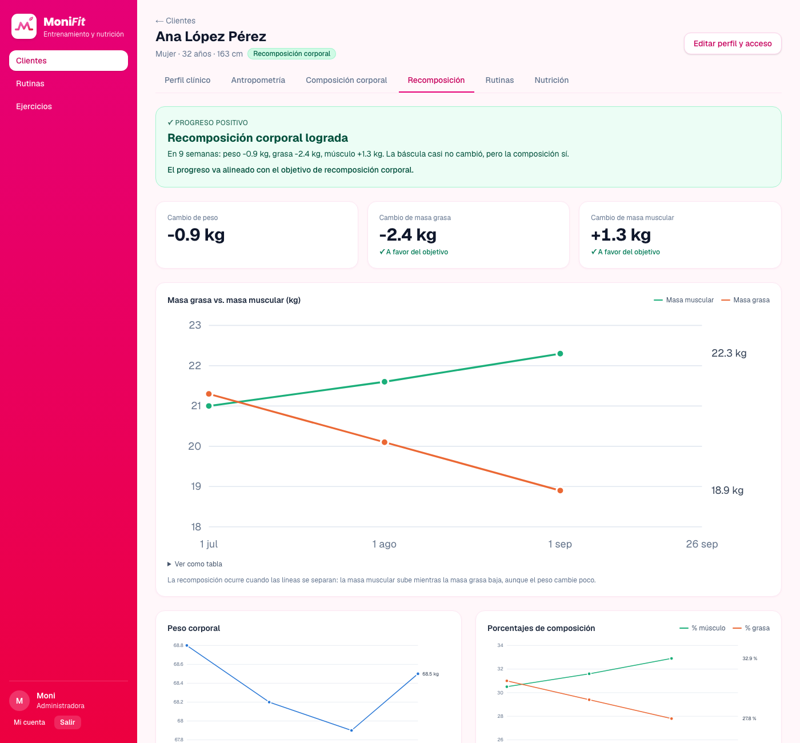</p>


### 3.6 Asignar una rutina

Expediente → pestaña **Rutinas**.

- Arriba se muestra la **rutina activa** con la **imagen de los músculos que trabaja** (rojo intenso =
  músculo principal, rojo claro = secundario) y su plan por día: ejercicio, series, repeticiones y descanso.
- Si el cliente tiene lesiones registradas, aparece un aviso amarillo para que adaptes los ejercicios.

<p align="center">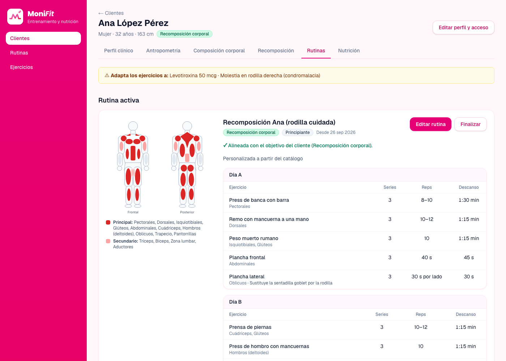</p>

- En **Recomendadas para (su objetivo)** tienes dos opciones por rutina:
  - **Asignar:** usa la rutina del catálogo tal cual.
  - **Personalizar:** crea una **copia solo para ese cliente** y abre el editor para ajustarla (por ejemplo,
    cambiar un ejercicio por una lesión). Los cambios no afectan al catálogo.
- Si asignas una rutina de otro objetivo, la app te avisa que no está alineada.
- **Finalizar** termina la rutina activa. Las anteriores quedan en el **Historial**, desde donde puedes
  **Reactivarlas**.

Solo puede haber **una rutina activa** por cliente: al asignar una nueva, la anterior pasa al historial.

<p align="center">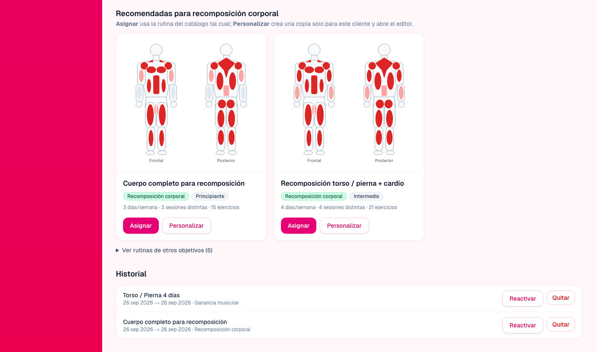</p>


### 3.7 Crear y editar rutinas y ejercicios

#### Catálogo de rutinas (menú **Rutinas**)
La app trae 8 rutinas base, dos por objetivo, con series, repeticiones y descansos adecuados a cada uno.
Puedes filtrarlas por objetivo.

<p align="center">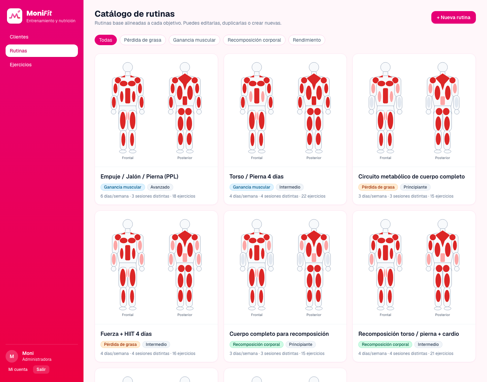</p>


- **+ Nueva rutina** o **Editar** abren el editor:
  1. Escribe nombre, objetivo, nivel, días por semana e indicaciones.
  2. En cada **día** (puedes renombrarlo, por ejemplo "Torso" o "Pierna") elige ejercicios de la lista
     **+ Agregar ejercicio del catálogo…**. Con **Filtrar el catálogo por músculo** encuentras rápido lo que buscas.
  3. Ajusta **series**, **repeticiones** (acepta texto: "8–10", "30 s", "12 por lado") y **descanso** en segundos.
     Con ▲ ▼ cambias el orden y con ✕ quitas un ejercicio.
  4. **+ Agregar día** suma otro día.
  5. A la derecha ves en vivo el **diagrama de músculos trabajados** y los parámetros recomendados para el objetivo.
  6. **Imagen propia (opcional):** si prefieres una foto o ilustración (PNG, JPG o WebP de hasta 4 MB),
     súbela ahí. Si no, la imagen de la rutina es el diagrama generado automáticamente.
  7. Presiona **Guardar rutina**.

<p align="center">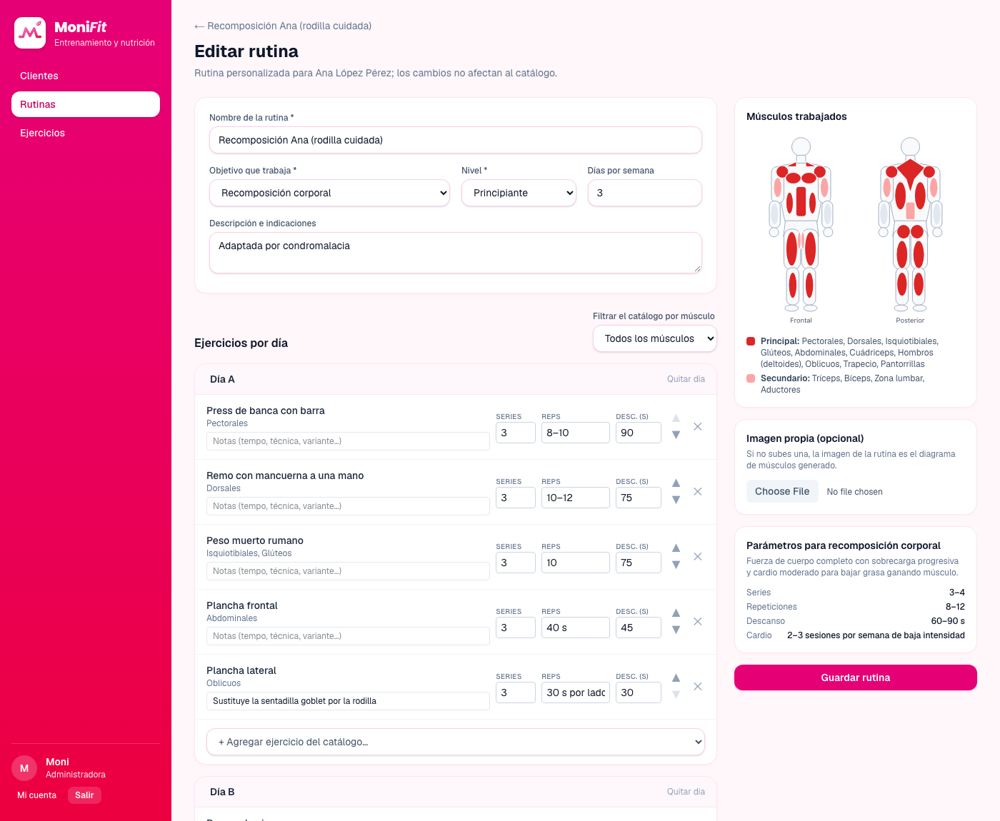</p>

- **Duplicar** crea una copia para hacer una variante.
- **Descargar imagen** baja la imagen de músculos de la rutina.

#### Catálogo de ejercicios (menú **Ejercicios**)
Trae 45 ejercicios propuestos.

<p align="center">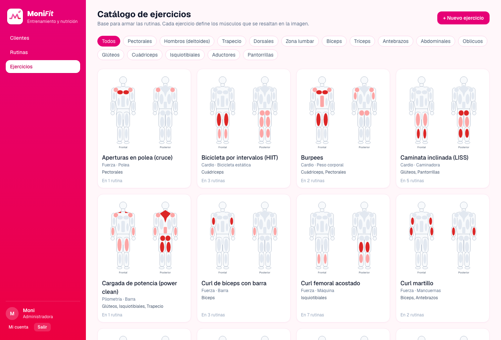</p>
 Para crear uno nuevo presiona **+ Nuevo ejercicio** y marca, para cada músculo,
si es **Principal**, **Secundario** o no participa (—). El dibujo se actualiza al momento: esa será la imagen
del ejercicio. Un ejercicio que se usa en alguna rutina **no se puede eliminar** hasta quitarlo de ellas.

<p align="center">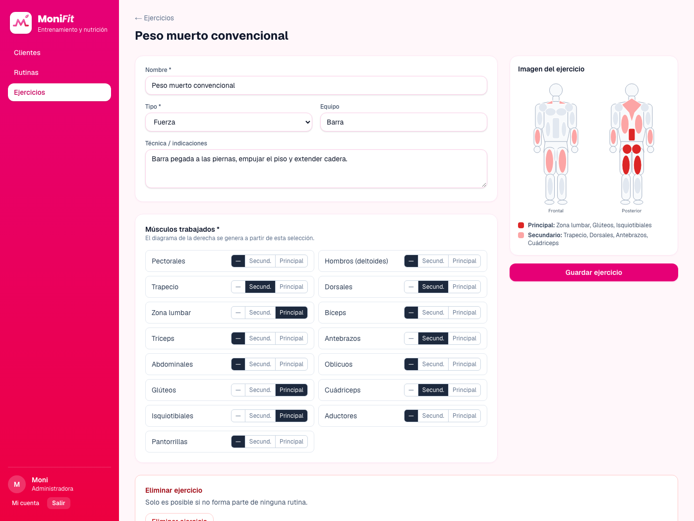</p>


### 3.8 Plan de nutrición mensual

Expediente → pestaña **Nutrición**. El cliente debe tener **al menos un peso registrado**.

#### Generar el plan
1. Elige la fecha de inicio y cuántas comidas al día hará (3 a 6).
2. Opcional:
   - **Ajuste manual (kcal):** sube o baja calorías si tú lo decides (por ejemplo, −100).
   - **Excluir además:** alimentos que no quiera, separados por comas (por ejemplo "atún, camote").
   - **Notas del plan**.
3. Presiona **Generar plan mensual**.

#### Cómo se calcula (para que puedas explicarlo)
- **Metabolismo basal:** si hay % de grasa reciente usa la fórmula de Katch-McArdle, que se basa en la masa
  magra; si no, usa Mifflin-St Jeor, con edad, estatura, peso y sexo.
- **Gasto total:** el metabolismo basal multiplicado por un factor según los días que entrena en su **rutina activa**.
- **Ajuste por objetivo:** −20 % para pérdida de grasa, −10 % para recomposición, +10 % para ganancia muscular
  y 0 % para rendimiento.
- **Proteína:** de 1.8 a 2.2 g por kilo según el objetivo. **Grasas:** alrededor de 25–35 % de las calorías.
  **Carbohidratos:** el resto.
- **Días de entrenamiento y de descanso:** los días que entrena lleva más carbohidratos y los de descanso un
  poco menos; el promedio de la semana es el mismo.
- **Alergias e intolerancias** excluyen grupos completos (por ejemplo "lactosa" quita todos los lácteos).
  Los **alimentos que no le gustan** quitan solo ese alimento, salvo que escriba una categoría como "pescado".

#### Qué contiene el plan

<p align="center">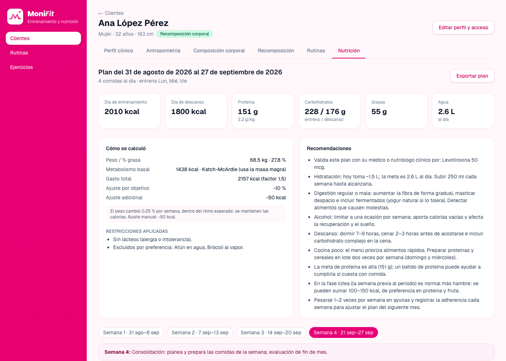</p>

- **Metas diarias:** calorías de día de entrenamiento y de descanso, proteína, carbohidratos, grasas y agua.
- **Cómo se calculó** y **restricciones aplicadas**.
- **Recomendaciones** personalizadas según sus respuestas: hidratación, digestión, alcohol, sueño, cocina,
  suplementos y ciclo menstrual. Si tiene enfermedades o toma medicamentos, el plan indica que un médico o
  nutriólogo debe validarlo.
- **4 semanas de menú**, cada una con un **enfoque de hábito** y cada día con sus comidas, porciones en
  **gramos y medidas caseras** (tazas, piezas, cucharadas) y el total del día.
- **Lista de compras** de cada semana.

<p align="center">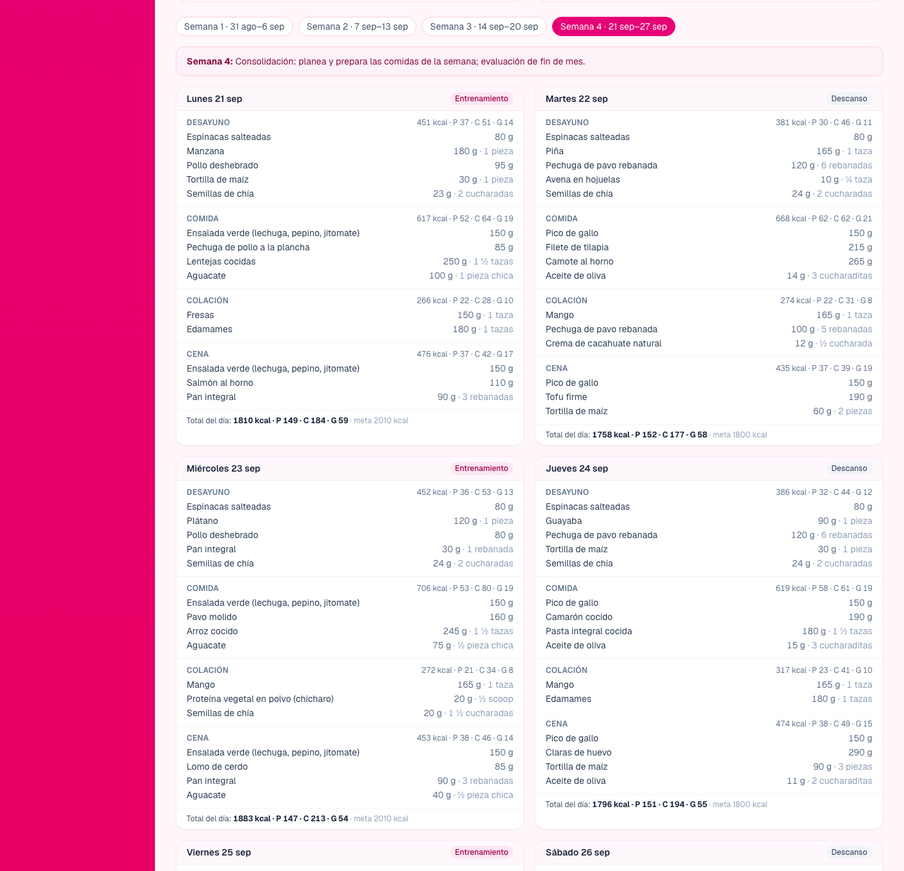</p>


#### Seguimiento semanal
Debajo del menú está **Seguimiento semanal**. Cada semana registra (o el cliente registra desde su portal):
- la **adherencia al plan** en porcentaje (qué tanto lo cumplió),
- el agua promedio,
- la **energía** y el **hambre** del 1 al 5,
- notas.

La gráfica muestra la tendencia de la adherencia.

<p align="center">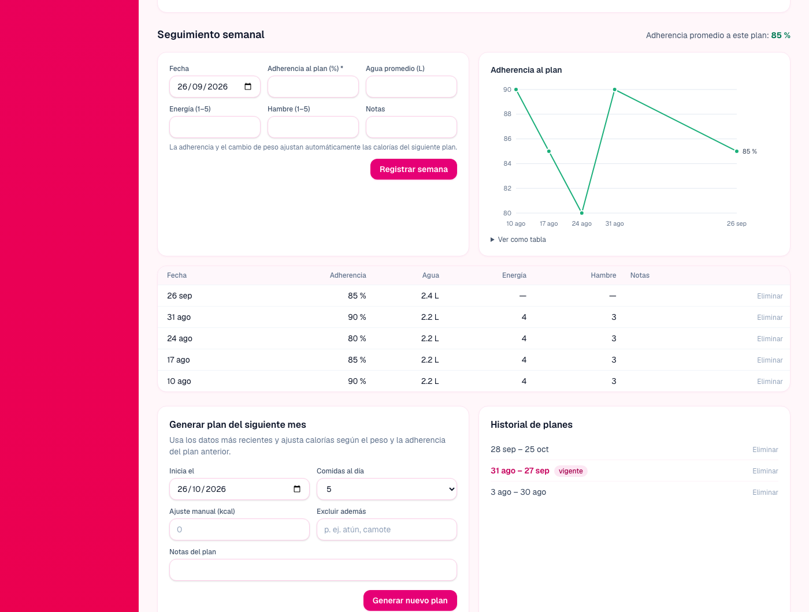</p>


#### El plan del mes siguiente
Al terminar el mes presiona **Generar nuevo plan**. La app revisa **cómo cambió el peso** y **la adherencia**
del plan anterior:
- Si la adherencia fue **75 % o más** y el peso **no avanzó** al ritmo esperado para su objetivo, ajusta las
  calorías automáticamente (entre 100 y 150 kcal) y explica por qué en *Cómo se calculó*.
- Si la adherencia fue baja, **mantiene** las calorías: primero hay que mejorar el cumplimiento.

Todos los planes quedan en el **Historial de planes**; el plan del mes en curso aparece marcado como **vigente**.

#### Exportar
Presiona **Exportar plan**. Se abre el plan completo (4 semanas, listas de compras, recomendaciones y rutina activa):
- **Descargar PDF / Imprimir:** en la ventana de impresión elige **"Guardar como PDF"**.
- **Descargar Excel (CSV):** una fila por alimento de cada comida de cada día, con gramos y macronutrientes.

<p align="center">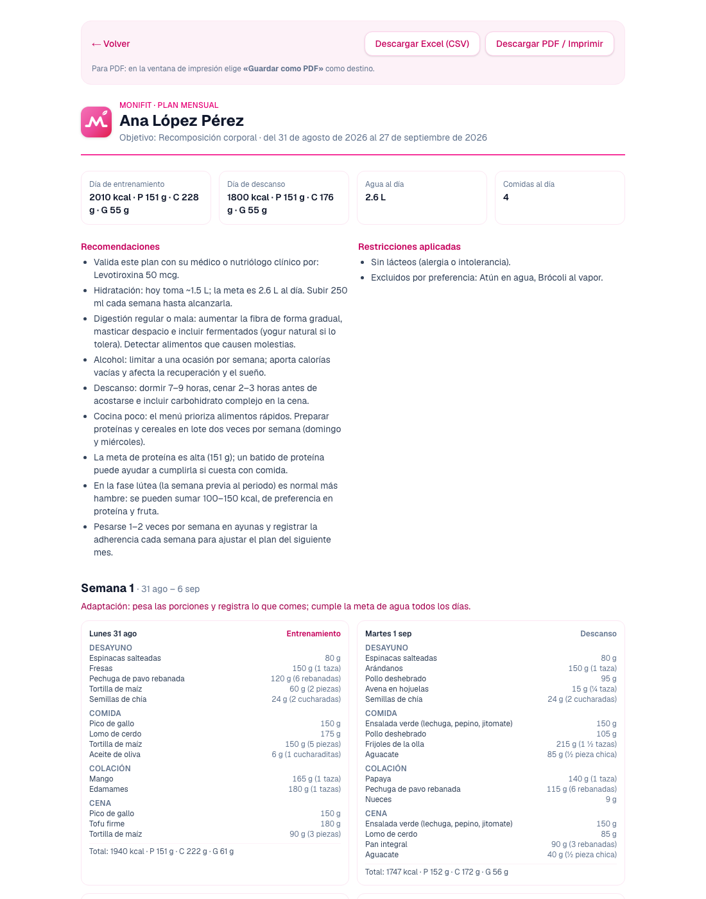</p>


### 3.9 Cambios y bajas de clientes

Todo está en **Editar perfil y acceso**:

| Quiero… | Qué hacer |
|---|---|
| Corregir datos o respuestas del cuestionario | Edita el formulario y presiona **Guardar cambios**. |
| Cambiar el objetivo del cliente | Elige el nuevo objetivo y guarda. Después revisa su rutina y genera un nuevo plan de nutrición. |
| Cambiar el correo con que entra | En *Acceso a la aplicación* → **Cambiar correo de acceso**. |
| Que el cliente vuelva a entrar porque olvidó su contraseña | **Generar contraseña temporal** y envíasela. La anterior deja de funcionar. |
| Baja temporal (deja de venir, pero quiero conservar su historial) | **Desactivar acceso**. No podrá entrar, pero su información se conserva. Puedes **Reactivar acceso** cuando quieras. |
| Baja definitiva | Abajo de todo: **Eliminar cliente**. Borra todo su expediente y su acceso, y **no se puede deshacer**. |

<p align="center">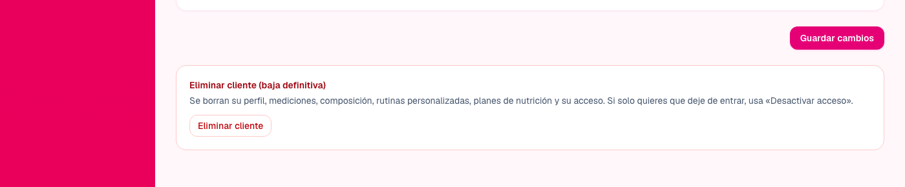</p>


### 3.10 Tu cuenta y tu contraseña

- **Mi cuenta** (barra rosa, abajo) → cambia tu contraseña cuando quieras. Al cambiarla se cierran las
  sesiones abiertas en otros equipos.
- **Salir** cierra tu sesión. Hazlo siempre en computadoras que no sean tuyas.

<p align="center">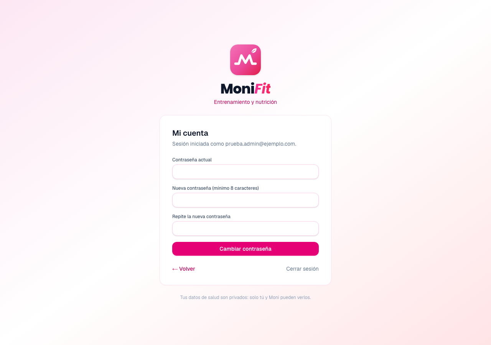</p>

- Si escribes mal la contraseña **5 veces seguidas**, el acceso se bloquea **15 minutos** por seguridad.
- **¿Olvidaste tu contraseña?** Pide a quien instaló la app que ejecute este comando en la computadora
  donde está instalada. Te dará una nueva contraseña temporal:
  ```bash
  npm run admin -- monica@moni-fit.com Moni
  ```

---

### 3.11 Avisos por Telegram

MoniFit puede avisar por **Telegram** a tus clientes, y a ti, cuando pasa algo importante. Es gratis. Los
mensajes **nunca llevan datos de salud**: solo un aviso corto con el botón **Abrir MoniFit**, y la información se
ve dentro de la app, con contraseña.

<p align="center">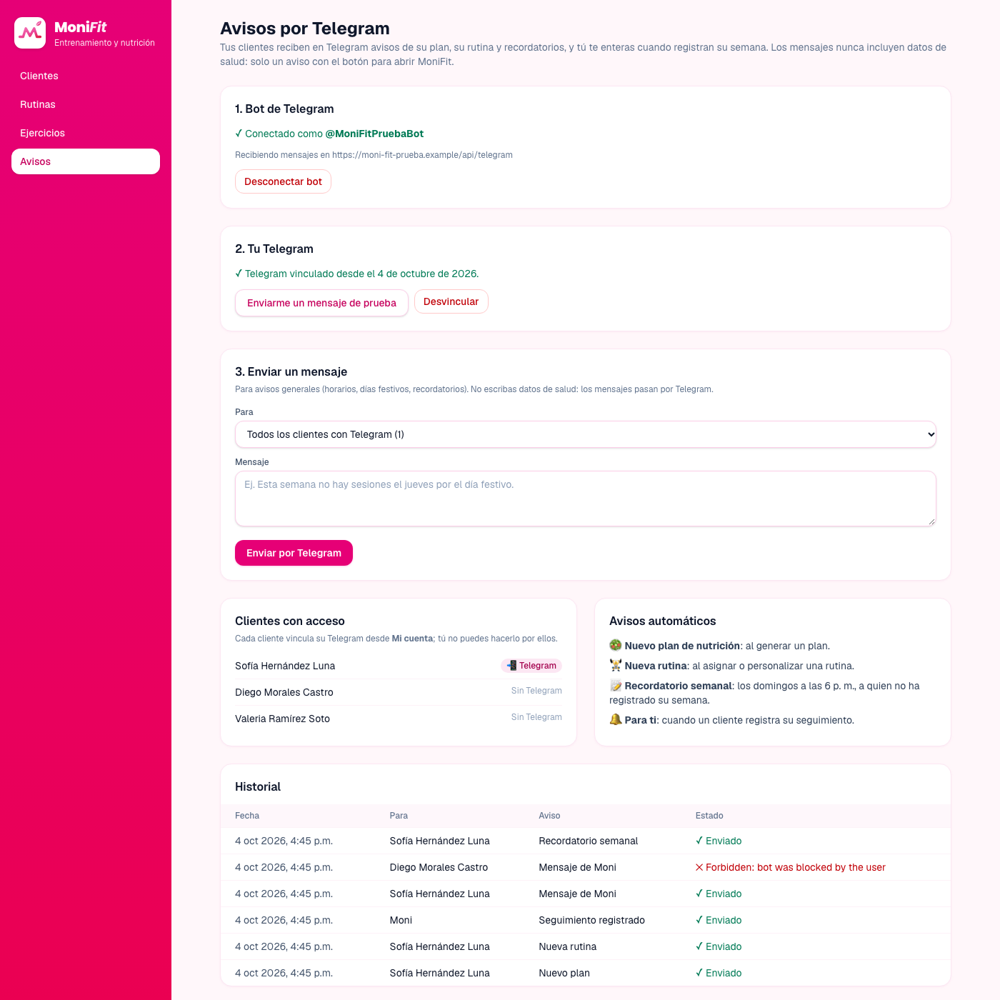</p>

**Configuración (una sola vez):**
1. En Telegram, busca **@BotFather** (el bot oficial de Telegram para crear bots) y escríbele `/newbot`.
2. Te pide un **nombre**: escribe `MoniFit`.
3. Te pide un **usuario** que termine en `bot`, por ejemplo `MoniFitAvisosBot` (si está ocupado, prueba otro).
4. BotFather responde con un **token**, un texto largo como `123456789:AAH…`. **Es secreto**: no lo compartas.
5. En MoniFit entra a **Avisos** (menú rosa), pega el token y presiona **Conectar bot**. Debe aparecer
   *"✓ Conectado como @TuBot"*.
6. En **2. Tu Telegram** presiona **Vincular Telegram** → se abre Telegram → presiona **Iniciar**. Desde ese
   momento te llegarán avisos. Para comprobarlo, usa **Enviarme un mensaje de prueba**.

**Qué avisos se envían solos:**
| Aviso | A quién | Cuándo |
|---|---|---|
| 🥗 Tu nuevo plan de nutrición ya está listo | Cliente | Al generar su plan |
| 🏋️ Moni te asignó una nueva rutina | Cliente | Al asignar o personalizar su rutina |
| 📝 ¿Cómo te fue esta semana? | Cliente que aún no registró su semana | Domingos a las 6 p. m. (no se repite) |
| 🔔 *Cliente* registró su seguimiento semanal | Tú | Cuando un cliente lo registra desde su portal |

**Mensajes tuyos:** en **3. Enviar un mensaje** eliges *Todos los clientes con Telegram* o una persona, escribes
y presionas **Enviar por Telegram**. Sirve para avisos generales (días festivos, cambios de horario). No escribas
datos de salud en estos mensajes.

**Problemas al configurar el bot:**
| Mensaje o situación | Qué hacer |
|---|---|
| *"Ese no parece un token de BotFather"* | Copia el token completo: números, dos puntos y letras, sin espacios. Si lo perdiste, en @BotFather escribe `/mybots` → tu bot → **API Token**. |
| *"Telegram rechazó el token"* | El token cambió o se revocó. Pide uno nuevo en @BotFather (`/mybots` → tu bot → **API Token** → **Revoke**) y pégalo otra vez. |
| *"Abre MoniFit desde su dirección pública con HTTPS"* | Entra por **https://moni-fit.com** (no por una IP ni por `localhost`) y vuelve a conectar. |
| BotFather dice que el usuario ya está ocupado | Prueba con otro que termine en `bot`, por ejemplo `MoniFitAvisos2Bot`. |
| Quiero cambiar de bot | **Desconectar bot** y conecta el nuevo token. Los clientes tendrán que volver a vincularse. |
| Quiero cambiar la foto o la descripción del bot | En @BotFather: `/setuserpic` y `/setdescription`. |

**Clientes:** cada quien activa Telegram por su cuenta desde **Mi cuenta** (tú no puedes hacerlo por ellos);
la [guía para clientes, 4.4](#44-activar-los-avisos-por-telegram-opcional) lo explica paso a paso. En
*Avisos → Clientes con acceso* y en *Acceso a la aplicación* de cada cliente ves quién ya lo tiene. Si alguien
bloquea el bot, la app lo desvincula sola. Abajo, el **Historial** muestra cada aviso enviado y si hubo algún error.

## 4. Guía para los clientes

*Esta sección está escrita para los clientes de Moni.*

> **Moni:** esta guía es pública; tus clientes la pueden abrir sin crear ninguna cuenta. Compárteles este enlace:
> **https://github.com/cj-developers-qro/monica-app#4-guía-para-los-clientes**

> **Lo único que tú capturas** es tu contraseña (la primera vez), la aceptación del aviso de privacidad y,
> **cada semana, tu seguimiento**. Todo lo demás (medidas, rutina y plan de nutrición) lo registra Moni.
> Activar los avisos por Telegram es opcional.

### 4.1 Tu primer ingreso
1. Moni te comparte tres cosas: la dirección **https://moni-fit.com**, tu **correo** y una **contraseña temporal**
   (algo como `fresa-luna-4821`).
2. Abre https://moni-fit.com en tu celular o computadora, escribe tu correo y la contraseña temporal, y presiona
   **Entrar**.
3. Crea **tu propia contraseña**: escribe primero la temporal, luego tu nueva contraseña dos veces (mínimo 8
   caracteres) y presiona **Guardar y continuar**.
4. Lee el **aviso de privacidad**, que explica cómo se cuidan tus datos de salud. Al final, marca la casilla y
   presiona **Acepto y continuar**. Solo se te pide una vez.

<p align="center">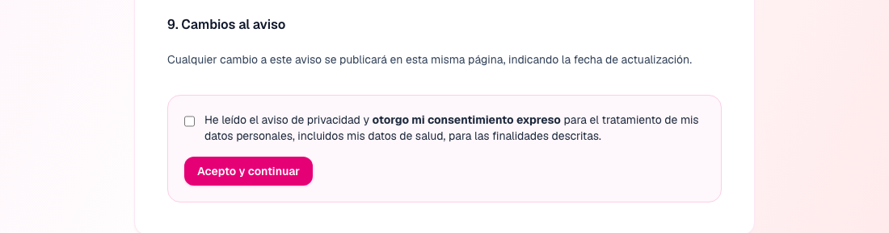</p>

5. Entras a **Mi resumen**. ¡Listo!

### 4.2 Qué encuentras en la app
La barra rosa de arriba tiene tres secciones:

| Sección | Qué ves |
|---|---|
| **Mi resumen** | Tu peso, % de grasa y % de músculo más recientes, cómo va tu progreso, las fechas de tu plan de nutrición y **tu rutina**: la imagen de los músculos que trabajas y los ejercicios de cada día, con series, repeticiones y descanso. |
| **Mi progreso** | Tus gráficas de peso, grasa y músculo a lo largo del tiempo, y la tabla con tus medidas. |
| **Mi nutrición** | Tu menú del mes, semana por semana: cada comida con sus porciones en gramos y en medidas caseras (tazas, piezas, cucharadas), la lista de compras de la semana y el **seguimiento semanal**. |

<p align="center">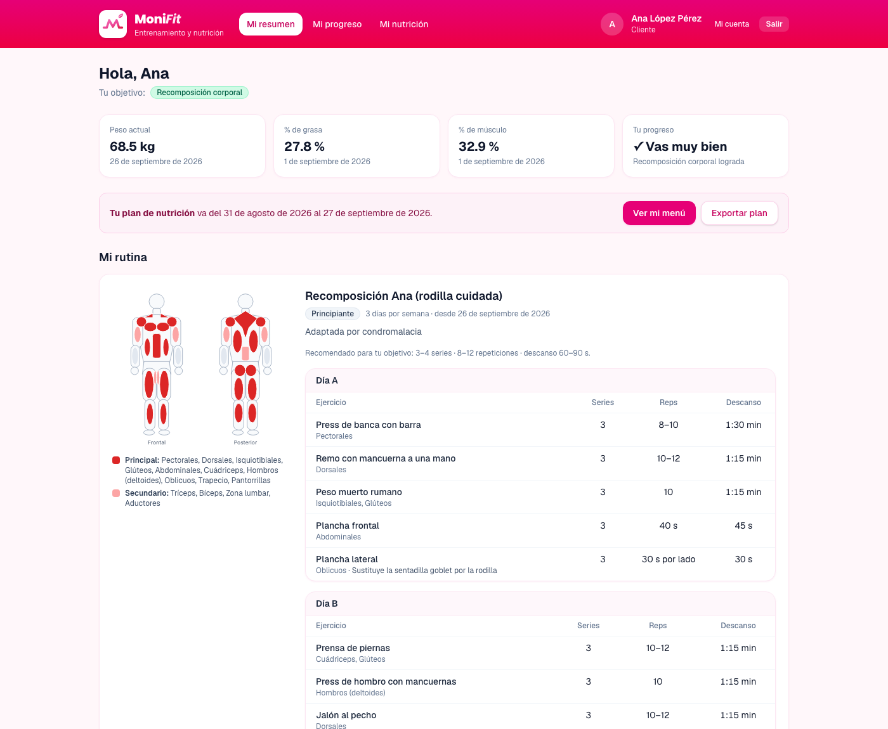</p>

**Cómo leer tu rutina:**
- **Series:** cuántas veces repites el bloque del ejercicio.
- **Reps (repeticiones):** cuántas veces haces el movimiento en cada serie. "10–12" significa entre 10 y 12; "30 s" significa sostenerlo 30 segundos.
- **Descanso:** el tiempo que descansas entre una serie y la siguiente.
- **Día A, Día B…:** cada día es una sesión distinta; alterna los días según lo que te indique Moni.

<p align="center">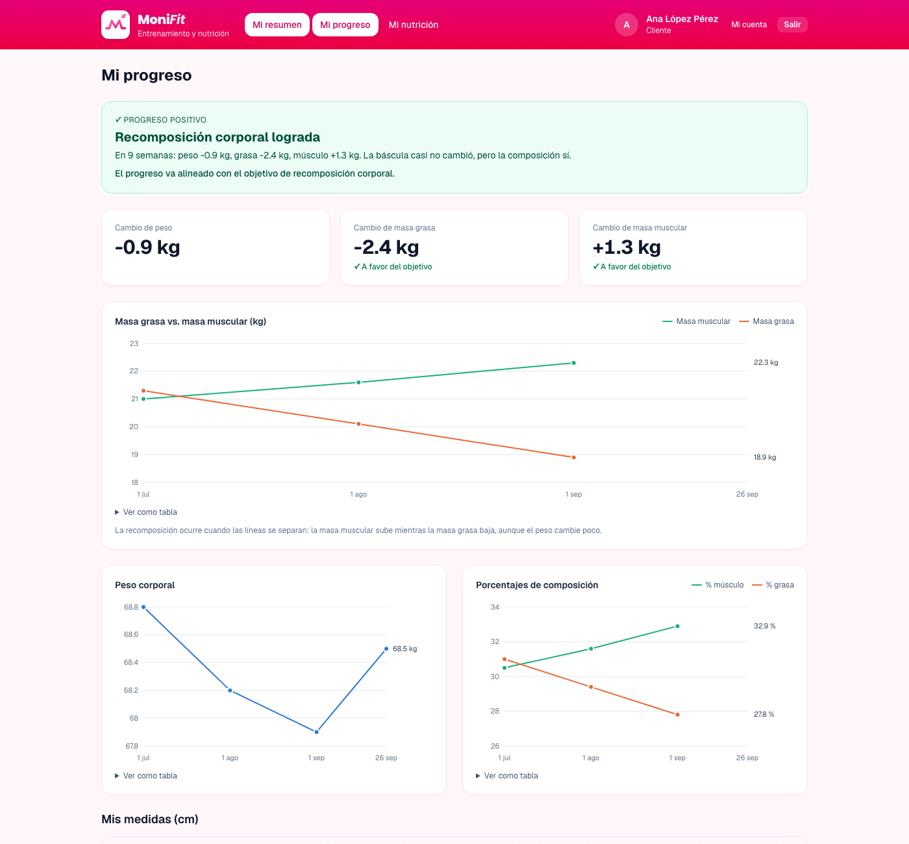</p>

**Cómo leer tu plan de nutrición:**
- Los días de **Entrenamiento** tienen un poco más de carbohidratos que los de **Descanso**.
- Los botones **Semana 1 a 4** cambian la semana que ves; la semana actual se abre sola.
- Al final de cada semana está la **Lista de compras**.
- En **Recomendaciones** hay consejos personalizados (agua, descanso, digestión…).

<p align="center">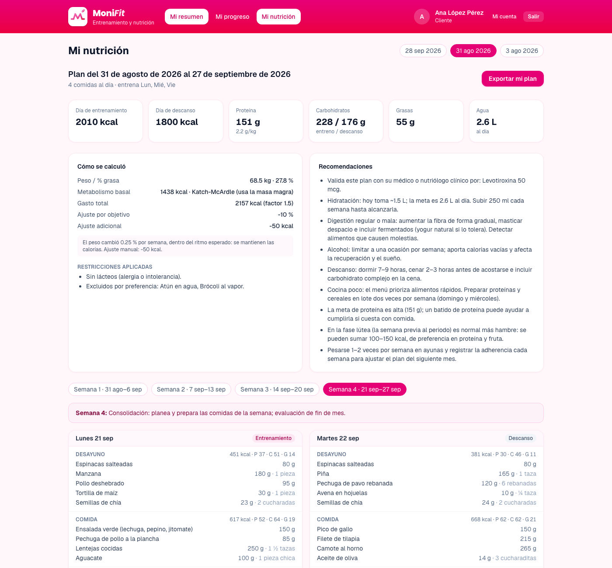</p>

### 4.3 Registrar tu semana (cada domingo, 1 minuto)
Es lo único que capturas con regularidad, y es muy importante: con esto **Moni ajusta tu plan del siguiente mes**.

1. Entra a **Mi nutrición** y baja hasta **Seguimiento semanal**.
2. Llena los campos:
   - **Adherencia al plan (%)**, obligatorio: qué tanto seguiste el plan esa semana. Cuenta las comidas que
     hiciste como decía el plan y divídelas entre las comidas de la semana. Ejemplo: con 4 comidas al día son
     28; si cumpliste 21, escribe **75**.
   - **Agua promedio (L):** litros al día, por ejemplo `2.5`.
   - **Energía (1–5):** 1 = muy cansado, 3 = normal, 5 = con mucha energía.
   - **Hambre (1–5):** 1 = nada de hambre, 3 = normal, 5 = mucha hambre todo el día.
   - **Notas:** lo que Moni deba saber, por ejemplo "tuve una boda el sábado" o "el camote me cayó pesado".
3. Presiona **Registrar semana**. Verás tu registro en la tabla y en la gráfica.

<p align="center">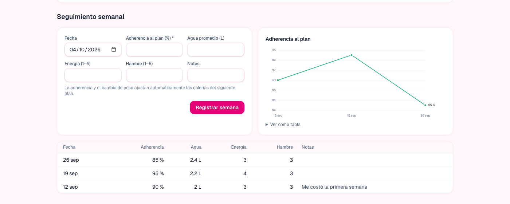</p>

> Sé honesto: un 60 % real ayuda más que un 100 % que no fue. Moni usa estos datos para ajustar tu plan, no para regañarte.

### 4.4 Activar los avisos por Telegram (opcional)
Con Telegram recibes en tu celular:
- 🥗 **"Tu nuevo plan de nutrición ya está listo"**, cuando Moni te prepara uno nuevo.
- 🏋️ **"Moni te asignó una nueva rutina"**, cuando cambia tu rutina.
- 📝 **"¿Cómo te fue esta semana?"**, los domingos en la tarde, solo si aún no registras tu semana.
- 💬 **Mensajes de Moni**, por ejemplo cambios de horario o días festivos.

Cada aviso trae el botón **Abrir MoniFit**. Por privacidad, los mensajes **nunca incluyen tus datos de salud**:
esos solo se ven dentro de la app, con tu contraseña.

**Cómo activarlo:**
1. Si no tienes Telegram, instálalo desde la App Store o Google Play y crea tu cuenta con tu número de celular.
2. En MoniFit verás la invitación **"¿Quieres recibir los avisos de Moni en Telegram?"**: presiona
   **Activar avisos**. También puedes entrar a **Mi cuenta** (arriba a la derecha) → **Avisos por Telegram**.

<p align="center">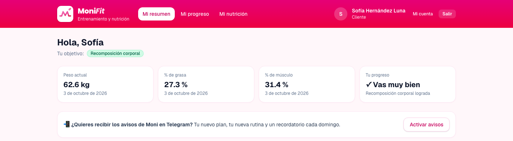</p>

3. Presiona **📲 Vincular Telegram**. Se abre Telegram con el bot de MoniFit.

<p align="center"></p>

4. En Telegram, presiona **Iniciar** (o *Start*). El bot te responde *"✅ ¡Listo! Aquí recibirás los avisos de MoniFit"*.
5. Vuelve a MoniFit y recarga la página: en **Mi cuenta** verás **"✓ Telegram vinculado"**. Con **Enviarme un
   mensaje de prueba** compruebas que llega.

**Para dejar de recibir avisos:** en **Mi cuenta** presiona **Desvincular**, o escríbele `/desvincular` al bot.

**Si algo no funciona:**
| Problema | Solución |
|---|---|
| El bot dice *"Este enlace ya no es válido o expiró"* | El enlace dura 30 minutos y sirve una sola vez. Vuelve a **Mi cuenta → Vincular Telegram**. |
| Al presionar *Vincular Telegram* no se abre la app | Instala Telegram y vuelve a intentarlo. En computadora se abre Telegram Web o Telegram Desktop. |
| Ya no me llegan avisos | Si bloqueaste o detuviste el bot, la vinculación se quitó sola. Vuelve a vincularlo desde **Mi cuenta** (y desbloquea el bot si lo bloqueaste). |
| Le escribí al bot y no me contesta lo que pregunté | El bot solo **envía** avisos; no lee mensajes. Para hablar con Moni, usa su número personal. |

### 4.5 Descargar tu plan del mes
En **Mi nutrición** presiona **Exportar mi plan** (en **Mi resumen** el botón se llama **Exportar plan**):
- **Descargar PDF / Imprimir:** en la ventana de impresión elige **"Guardar como PDF"** como destino. Incluye
  las 4 semanas del menú, las listas de compras, las recomendaciones y tu rutina.
- **Descargar Excel (CSV):** una tabla con cada alimento de cada comida, por si quieres organizarte en Excel.

### 4.6 Tener MoniFit en tu celular como una app
- **iPhone (Safari):** abre https://moni-fit.com → botón **Compartir** (el cuadrito con flecha) → **Agregar a
  pantalla de inicio** → **Agregar**.
- **Android (Chrome):** abre https://moni-fit.com → menú **⋮** → **Agregar a la pantalla principal** → **Agregar**.

Aparecerá el ícono rosa de MoniFit junto a tus otras apps.

<p align="center">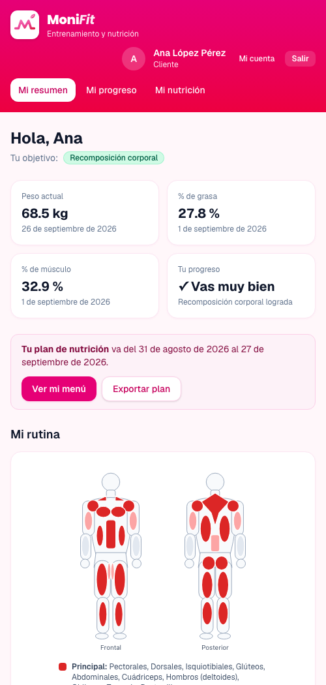</p>

### 4.7 Tu cuenta y tu contraseña
- **Cambiar tu contraseña:** **Mi cuenta** → escribe la actual y la nueva dos veces → **Cambiar contraseña**.
- **¿Olvidaste tu contraseña?** Pídele a Moni que te genere una nueva temporal; la app te pedirá cambiarla al entrar.
- **Bloqueo:** si escribes mal la contraseña 5 veces seguidas, espera 15 minutos antes de intentarlo de nuevo.
- **Salir:** en una computadora que no sea tuya, presiona siempre **Salir** al terminar.
- **Tus datos:** solo tú y Moni pueden verlos. Para consultar, corregir o borrar tus datos, escribe a
  **monica@moni-fit.com** (lo explica el aviso de privacidad, al pie de la pantalla de inicio de sesión).

### 4.8 Pequeño glosario
| Término | Qué significa |
|---|---|
| **% de grasa** | Qué parte de tu peso es grasa. |
| **% de músculo / masa muscular** | Qué parte de tu peso es músculo. |
| **Grasa visceral** | Grasa alrededor de los órganos; mientras más baja, mejor. |
| **Recomposición corporal** | Bajar grasa y subir músculo al mismo tiempo, aunque la báscula casi no cambie. |
| **Adherencia** | Qué tanto seguiste el plan (en %). |
| **kcal** | Kilocalorías: la energía de los alimentos. |
| **P · C · G** | Proteína, carbohidratos y grasas, en gramos. |

---

## 5. Rutina de trabajo recomendada para Moni

| Cuándo | Qué hacer |
|---|---|
| Cliente nuevo | Onboarding → crear acceso → registrar medidas y composición → asignar o personalizar rutina → generar plan de nutrición. |
| Cada semana | Revisar el **Seguimiento semanal** de nutrición de cada cliente (con Telegram vinculado, te llega un aviso cuando lo registran). |
| Cada 2–4 semanas | Registrar **medidas** y **composición corporal**; revisar **Recomposición**. |
| Cada mes | **Generar nuevo plan** de nutrición; si el progreso se estancó, ajustar o cambiar la rutina. |
| Cada mes (o más seguido) | **Respaldo** de los datos (ver [sección 8](#respaldos)). |

---

## 6. Preguntas frecuentes

**¿Por qué no aparece el diagnóstico de recomposición?**
Hacen falta al menos dos registros de composición con % de grasa **y** % de músculo.

**¿Por qué no puedo generar el plan de nutrición?**
El cliente necesita al menos un peso registrado en *Composición corporal*.

**¿Por qué el plan no incluye cierto alimento?**
Revisa *Restricciones aplicadas*: puede estar excluido por una alergia o porque no le gusta. Para excluir más
alimentos usa **Excluir además** al generar el plan.

**Cambié la rutina, ¿se actualiza el plan de nutrición?**
No automáticamente. Genera un plan nuevo para que tome en cuenta los nuevos días de entrenamiento.

**Un cliente dice que no puede entrar.**
Revisa en *Acceso a la aplicación* que esté **Activo** y que el correo sea correcto. Si no recuerda su
contraseña, genera una temporal. Si falló 5 veces, debe esperar 15 minutos.

**¿Puedo borrar una rutina del catálogo?**
Sí, pero se quitará también del historial de los clientes que la tuvieron asignada. Si solo quieres una
variante, usa **Duplicar**.

---

**¿Cómo comparto la guía con mis clientes?**
Envíales el enlace **https://github.com/cj-developers-qro/monica-app#4-guía-para-los-clientes**: se abre sin
crear ninguna cuenta. Inclúyelo en el [mensaje sugerido de bienvenida](#32-darle-acceso-a-la-app).

**El recordatorio de los domingos, ¿se puede cambiar de hora?**
Sí, pero es un ajuste técnico (el timer `monifit-recordatorio` del servidor). Pídeselo a quien administra el servidor.

**Un cliente dice que no le llegan los avisos de Telegram.**
Revisa en *Avisos → Clientes con acceso* que tenga Telegram vinculado y en el **Historial** si hubo errores. Si
bloqueó el bot, se desvinculó solo: pídele que lo vincule otra vez desde *Mi cuenta*.

**¿Puedo escribirle a un cliente por el bot y que me conteste?**
No: el bot solo **envía** avisos. Si alguien le escribe, el bot responde cómo vincular su cuenta. Para conversar,
usa tu Telegram o WhatsApp personal.

## 7. Privacidad y seguridad

- **Aviso de privacidad:** es público en `/privacidad` (enlace al pie del inicio de sesión). Cada cliente debe
  aceptarlo, con su consentimiento expreso para el tratamiento de datos de salud, antes de ver su información.
  En *Acceso a la aplicación* ves si cada cliente ya lo aceptó y cuándo. Los datos de la responsable se
  completan en `src/lib/privacidad.ts`; mientras falten, al entrar como administradora verás una advertencia en el aviso.
- **Telegram:** es opcional y lo activa cada persona. Los avisos pasan por Telegram, por eso nunca incluyen datos
  de salud. Solo se guarda el identificador del chat. El aviso de privacidad lo explica.
- Las contraseñas se guardan **cifradas** (scrypt); nadie puede leerlas, ni siquiera en la base de datos.
- Cada cliente solo puede ver y exportar **su propio** expediente. La app lo verifica en cada pantalla, en cada
  consulta y en cada acción, no solo en los menús.
- Las sesiones duran 30 días o hasta que la persona presiona **Salir**. Desactivar un acceso o restablecer una
  contraseña cierra de inmediato las sesiones de ese cliente.
- Tras 5 intentos fallidos el acceso se bloquea 15 minutos.
- La información de salud es sensible: si la app se publica en internet, debe servirse **solo con HTTPS**
  (ver sección 8).
- El plan nutricional y las rutinas son una **guía** generada con fórmulas estándar; no sustituyen una
  valoración médica.

---

## 8. Información técnica (instalación y mantenimiento)

*Esta sección es para la persona que instala o mantiene la aplicación.*

### Marca
El logotipo (`src/app/icon.svg`, copia en `docs/logo-monifit.svg`) es una "M" trazada como línea de pulso
(entrenamiento) con una hoja (nutrición). En el código vive en `src/components/Logo.tsx`
(`IconoMoniFit`, `NombreMoniFit`). El nombre usa la tipografía Poppins y `src/app/apple-icon.png` es el
ícono para la pantalla de inicio del celular. Las capturas del manual están en `docs/capturas/`.

### Tecnología
- **Next.js 16** (App Router, Server Components y Server Actions) + **Tailwind CSS 4**. Un solo estilo
  compartido (rosa y blanco) definido en `src/app/globals.css`, con las clases `boton`, `campo`, `tarjeta`,
  `chip`, `pestana`, `menu-enlace`, etc.
- **SQLite** con el módulo nativo `node:sqlite` de Node (sin dependencias externas). El esquema está en
  `src/lib/esquema.sql` y se aplica solo al abrir la base.
- **Autenticación propia:** contraseñas con scrypt, sesiones en base de datos (cookie `httpOnly` con token
  aleatorio; en la base solo se guarda su SHA-256), bloqueo por intentos, y roles `admin` y `cliente`.

### Requisitos e instalación
Requiere **Node.js 24 o superior**.

```bash
npm install
npm run build
npm run admin -- monica@moni-fit.com Moni   # crea la cuenta de Moni y muestra su contraseña temporal
npm start                                        # http://localhost:3000
```

Para desarrollo: `npm run dev`.

`npm run admin -- <correo> [nombre]` crea la cuenta de administradora o, si ya existe, le asigna una **nueva
contraseña temporal** y cierra sus sesiones. Sirve también para recuperar el acceso de Moni.

`npm run demo` carga (o recarga) los 3 clientes de demostración con sus planes, usando el mismo motor de
nutrición de la app, y muestra las contraseñas temporales de su portal. `npm run demo -- --borrar` los elimina.
Solo afecta a los clientes marcados como demostración.

**Telegram:** el token del bot se guarda en la tabla `configuracion` cuando Moni lo pega en *Avisos* (también
puede definirse con la variable `TELEGRAM_BOT_TOKEN`). Al conectarlo, la app registra el webhook
`https://<dominio>/api/telegram` con un secreto derivado del token, y Telegram lo envía en cada llamada. La
conexión debe hacerse desde la dirección pública con HTTPS. El recordatorio semanal lo ejecuta el timer
`monifit-recordatorio.timer` (domingos 18:00, hora de Ciudad de México); a mano: `npm run recordatorio`. Para
pruebas sin Telegram real existe `TELEGRAM_API_URL`, que apunta a una API simulada.

### Datos y respaldos <a id="respaldos"></a>
Todos los datos viven en la carpeta **`data/`** (ignorada por git):
- `data/app-deportiva.db` — base de datos: clientes, medidas, rutinas, planes, usuarios.
- `data/imagenes/` — imágenes propias subidas a las rutinas.

**Respaldo:** detén la app (o asegúrate de que nadie la use) y copia la carpeta `data/` completa a un lugar
seguro. Para restaurar, vuelve a colocarla. Con la variable `DATA_DIR` puedes guardar los datos en otra ruta.

### Acceso de los clientes desde su celular
Con `npm start` la app solo es accesible en esa computadora (y en la misma red Wi-Fi mediante
`http://<IP-de-la-computadora>:3000`). Para entrar desde cualquier lugar hay que servirla con **HTTPS**.

**Para pruebas o demostraciones (túnel rápido de Cloudflare, sin cuenta):**
```bash
npm run build && npm start                         # terminal 1
cloudflared tunnel --no-autoupdate --url http://localhost:3000   # terminal 2
```
`cloudflared` muestra una dirección `https://<palabras>.trycloudflare.com`. Funciona mientras las dos
terminales y la computadora estén encendidas, y **cambia cada vez que se reinicia el túnel**.

**Para uso diario:** publícala en la nube con dirección fija; la guía completa está en la
[sección 9](#9-publicar-en-la-nube-oracle-cloud-gratis--moni-fitcom).

### Estructura
```
deploy/                      instalación y operación en el servidor (ver sección 9)
scripts/admin.mts            crea o restablece la cuenta de administradora
scripts/datos-demo.mts       clientes de demostración (npm run demo)
scripts/cargador.mjs         permite a Node ejecutar los módulos TypeScript de src/ desde los scripts
src/proxy.ts                 sin sesión → /login (filtro inicial)
src/app/(acceso)/            login y "Mi cuenta"
src/app/(admin)/             panel de Moni: clientes, rutinas, ejercicios
src/app/(portal)/portal/     portal del cliente: resumen, progreso, nutrición
src/app/(exportar)/          plan mensual imprimible y descarga CSV
src/app/acciones/            acciones del servidor (cada una verifica el rol)
src/components/              componentes compartidos (logotipo, vistas de plan, recomposición, formularios…)
src/lib/auth.ts              sesiones y verificación de roles
src/lib/contrasenas.ts       cifrado (scrypt) y contraseñas temporales
src/lib/privacidad.ts        datos del aviso de privacidad (completar antes de publicar)
src/lib/telegram.ts          cliente de la API de bots de Telegram (token, webhook, envío)
src/lib/notificaciones.ts    avisos a clientes y administradora, con historial
src/app/api/telegram/        webhook del bot (vinculación con /start <código>, /desvincular)
src/app/(admin)/avisos/      pantalla Avisos (conectar el bot, mensajes, historial)
scripts/recordatorio-semanal.mts  recordatorio de los domingos (npm run recordatorio)
src/app/(legal)/privacidad/  aviso de privacidad y consentimiento de los clientes
src/app/salud/               chequeo de salud para el monitoreo
src/lib/datos.ts             consultas; cada una verifica quién la pide
src/lib/nutricion.ts         motor del plan de nutrición
src/lib/recomposicion.ts     motor del diagnóstico de recomposición
src/lib/musculos.ts          catálogo de músculos y diagrama SVG
src/lib/catalogo-semilla.ts  45 ejercicios y 8 rutinas iniciales
src/lib/alimentos.ts         base de 56 alimentos con macronutrientes
```

---

## 9. Publicar en la nube (Oracle Cloud gratis + moni-fit.com)

*Guía para quien instala la app. Resultado: MoniFit en **https://moni-fit.com**, con HTTPS, respaldos diarios
y monitoreo, por **$0 al mes** (solo se paga la renovación del dominio).*

```
Clientes y Moni ──HTTPS──▶ Cloudflare (DNS, certificado y protección · gratis)
                                │ túnel cifrado (el servidor no abre ningún puerto)
                                ▼
                  Oracle Cloud Always Free · Ubuntu 24.04 · ARM Ampere
                  ├─ MoniFit (servicio "monifit", solo escucha en 127.0.0.1:3000)
                  ├─ /var/lib/monifit     ← base de datos e imágenes
                  └─ /var/backups/monifit ← respaldo diario ──▶ Cloudflare R2 (gratis hasta 10 GB)
```

| Pieza | Para qué | Costo |
|---|---|---|
| Oracle Cloud Always Free (Ampere A1) | Servidor donde corre la app | $0 |
| Cloudflare (plan Free) | DNS de moni-fit.com, HTTPS, túnel y protección | $0 |
| Cloudflare R2 | Copia de los respaldos fuera del servidor | $0 (hasta 10 GB) |
| UptimeRobot (plan Free) | Aviso por correo si la app se cae | $0 |
| Dominio moni-fit.com (GoDaddy) | Dirección de la app | Renovación anual |

> Los precios y límites de los planes gratuitos pueden cambiar; revísalos al contratar.

### 9.0 Antes de empezar
- [x] Datos de la responsable en el aviso de privacidad (`src/lib/privacidad.ts`): completos.
- [ ] Pide que una persona asesora en protección de datos revise el texto del aviso.
- [ ] Verifica que el buzón **monica@moni-fit.com** exista y reciba correo: es el contacto del aviso de privacidad.
- [ ] Decide si conservas los clientes de demostración o los quitas (`npm run demo -- --borrar`).
- [ ] Ten a la mano: cuenta de GitHub con acceso al repositorio, cuenta de GoDaddy y una tarjeta para verificar
      la cuenta de Oracle (no se cobra mientras uses solo recursos Always Free).

### 9.1 Crear el servidor en Oracle Cloud
1. Crea tu cuenta en **cloud.oracle.com** → *Sign up*. Elige la **región de origen** con cuidado, porque
   no se puede cambiar después; la más cercana es *Mexico Central (Querétaro)*.
2. **Recomendado:** en *Billing → Upgrade and manage payment*, cambia la cuenta a **Pay As You Go**. Mientras
   uses solo recursos *Always Free* sigue siendo gratis, pero así Oracle **no reclama el servidor por estar
   inactivo** (algo que sí puede pasar en cuentas gratuitas) y hay más disponibilidad. Después, en
   *Billing → Budgets*, crea un presupuesto de $1 USD con alerta por correo para enterarte de cualquier cargo.
3. Ve a *Compute → Instances → Create instance*:
   - **Name:** `monifit`
   - **Image:** *Canonical Ubuntu 24.04*
   - **Shape:** *Ampere → VM.Standard.A1.Flex*, **1 OCPU y 6 GB de memoria** (dentro del límite gratuito).
   - **Networking:** la red que propone por defecto, con **IP pública** asignada.
   - **SSH keys:** *Generate a key pair for me* → **descarga la llave privada** y guárdala en un lugar seguro.
   - **Boot volume:** 50 GB.
4. Presiona **Create**. Si aparece *Out of capacity*, intenta con otro *Availability domain* o más tarde.
5. Anota la **IP pública** de la instancia.

> No hace falta abrir puertos: el túnel de Cloudflare sale del servidor hacia afuera. Deja solo el puerto 22 (SSH),
> que viene abierto por defecto.

### 9.2 Conectarte al servidor
En tu Mac (reemplaza la ruta de la llave y la IP):
```bash
chmod 600 ~/Downloads/ssh-key-monifit.key
ssh -i ~/Downloads/ssh-key-monifit.key ubuntu@<IP-del-servidor>
```

### 9.3 Instalar MoniFit
1. Desde tu Mac, en la carpeta de la app, copia el instalador al servidor:
   ```bash
   scp -i ~/Downloads/ssh-key-monifit.key deploy/instalar-servidor.sh ubuntu@<IP>:~
   ```
2. En el servidor:
   ```bash
   sudo bash instalar-servidor.sh
   ```
3. La primera vez se detiene y muestra una **clave pública** (empieza con `ssh-ed25519`): el servidor necesita
   permiso para descargar el código por SSH desde GitHub. Cópiala y agrégala en GitHub:
   *monica-app → Settings → Deploy keys → Add deploy key*, con el título `servidor Oracle` y **sin** marcar
   *Allow write access*.
4. Vuelve a ejecutar `sudo bash instalar-servidor.sh`. Instala Node.js 24, descarga y compila la app y
   deja activos el servicio `monifit` y el respaldo diario. Al final debe decir
   **"✓ MoniFit responde en el servidor"**.

### 9.4 Pasar el dominio a Cloudflare y crear el túnel
1. Crea una cuenta en **dash.cloudflare.com** → *Add a domain* → `moni-fit.com` → plan **Free**.
2. Cloudflare importa los registros DNS actuales. **El dominio tiene correo de GoDaddy (`monica@moni-fit.com`,
   el contacto del aviso de privacidad)**: antes de continuar, verifica que estén estos 7 registros. Si falta
   alguno, agrégalo a mano, porque sin ellos el correo dejaría de funcionar. En los CNAME, deja la nube en
   **gris (DNS only)**:

   | Tipo | Nombre | Contenido | Prioridad |
   |---|---|---|---|
   | MX | `@` | `smtp.secureserver.net` | 0 |
   | MX | `@` | `mailstore1.secureserver.net` | 10 |
   | TXT | `@` | `v=spf1 include:secureserver.net -all` | |
   | TXT | `_dmarc` | `v=DMARC1; p=quarantine; adkim=r; aspf=r; rua=mailto:dmarc_rua@onsecureserver.net;` | |
   | CNAME | `email` | `email.secureserver.net` | |
   | CNAME | `secureserver1._domainkey` | `s1.dkim.moni-fit_com.e20.onsecureserver.net` | |
   | CNAME | `secureserver2._domainkey` | `s2.dkim.moni-fit_com.e20.onsecureserver.net` | |
   | SRV | `_autodiscover._tcp` | `autodiscover.secureserver.net`, puerto 443, peso 0 | 0 |

   (Lista tomada del DNS público de moni-fit.com el 27 de septiembre de 2026.)
3. Cloudflare te dará **dos nameservers** (por ejemplo `ana.ns.cloudflare.com`). En **GoDaddy**:
   *Mis productos → moni-fit.com → DNS → Nameservers → Cambiar → Usaré mis propios servidores de nombres*,
   y escribe los dos de Cloudflare. El dominio sigue siendo tuyo en GoDaddy; solo cambia quién responde el DNS.
   La activación tarda de minutos a 24 horas: Cloudflare te avisa por correo.
4. En Cloudflare: *Zero Trust → Networks → Tunnels → Create a tunnel → Cloudflared*, con el nombre `monifit`.
   En el comando de instalación que muestra, copia **solo el token** (el texto largo después de `install`).
5. En el servidor:
   ```bash
   sudo CLOUDFLARE_TUNNEL_TOKEN=<token> bash instalar-servidor.sh
   ```
6. Hoy `moni-fit.com` apunta a la página de GoDaddy. En Cloudflare, en *DNS → Records*, **borra solo** los dos
   registros **A** de `moni-fit.com` (`76.223.105.230` y `13.248.243.5`) y el **CNAME** `www`. **No toques los
   del correo.** Después, de vuelta en el túnel, en *Public hostnames → Add a public hostname*, agrega:
   - `moni-fit.com` → Service **HTTP** → `localhost:3000`
   - `www.moni-fit.com` → Service **HTTP** → `localhost:3000`
7. En *SSL/TLS → Edge Certificates*, activa **Always Use HTTPS**.
8. Abre **https://moni-fit.com**: debe aparecer el inicio de sesión de MoniFit.

### 9.5 Llevar los datos
**Opción A — migrar lo que ya existe en tu Mac** (cuenta de Moni, clientes, planes, imágenes):
```bash
LLAVE_SSH=~/Downloads/ssh-key-monifit.key ./deploy/migrar-datos.sh ubuntu@<IP>
```
Hace una copia consistente de `data/`, la envía y la restaura en el servidor. Si el servidor ya tenía datos,
antes guarda una copia de ellos.

**Opción B — empezar con la base vacía** y solo la cuenta de Moni:
```bash
sudo -u monifit bash -c 'set -a; . /etc/monifit/monifit.env; cd /opt/monifit && npm run admin -- monica@moni-fit.com Moni'
```
Anota la contraseña temporal que muestra y entrégasela a Moni.

### 9.6 Respaldos fuera del servidor (Cloudflare R2)
El servidor ya guarda un respaldo diario a las 3:30 (conserva los últimos 14), pero conviene tener una copia
**fuera** de él:
1. En Cloudflare: *R2 → Create bucket* → nombre `monifit-respaldos`.
2. *R2 → Manage API tokens → Create API token* → permiso **Object Read & Write** solo para ese bucket.
   Copia el *Access Key ID*, el *Secret Access Key* y el *endpoint* (`https://<ID>.r2.cloudflarestorage.com`).
3. En el servidor, edita `sudo nano /etc/monifit/respaldo.env`, descomenta las 6 líneas y llénalas.
4. Pruébalo:
   ```bash
   sudo systemctl start monifit-respaldo && journalctl -u monifit-respaldo -n 20
   ```
   Debe aparecer *"Copia remota: r2:monifit-respaldos/…"*.
5. Opcional: en el bucket, *Settings → Object lifecycle rules*, borra los respaldos con más de 30 días.

### 9.7 Monitoreo
En **uptimerobot.com** (plan gratuito) crea un monitor *HTTP(s)* hacia **https://moni-fit.com/salud** cada
5 minutos, con alerta a tu correo. Esa dirección responde `{"ok":true}` cuando la app y la base de datos funcionan.

### 9.8 Operación del día a día
| Quiero… | Comando en el servidor |
|---|---|
| Publicar una versión nueva (después de subirla a GitHub) | `sudo /opt/monifit/deploy/actualizar.sh` (respalda, compila y reinicia) |
| Ver si la app está funcionando | `systemctl status monifit cloudflared` |
| Ver los registros de la app | `journalctl -u monifit -f` |
| Hacer un respaldo ahora | `sudo systemctl start monifit-respaldo` |
| Enviar ahora el recordatorio semanal de Telegram | `sudo systemctl start monifit-recordatorio && journalctl -u monifit-recordatorio -n 5` |
| Restaurar un respaldo | `sudo /opt/monifit/deploy/restaurar.sh /var/backups/monifit/<archivo>.tar.gz` |
| Traer un respaldo de R2 | `sudo -u monifit bash -c 'set -a; . /etc/monifit/respaldo.env; rclone copy r2:monifit-respaldos/<archivo> /tmp/'` |
| Nueva contraseña temporal para Moni | `sudo -u monifit bash -c 'set -a; . /etc/monifit/monifit.env; cd /opt/monifit && npm run admin -- monica@moni-fit.com Moni'` |

Si el servidor se reinicia, la app, el túnel y el respaldo diario vuelven a arrancar solos. Las
actualizaciones de seguridad de Ubuntu se instalan automáticamente.

### 9.9 Seguridad del servidor
- La app solo escucha en `127.0.0.1`: desde internet solo se llega a ella por el túnel de Cloudflare, con HTTPS.
- No hay puertos abiertos aparte de SSH, y SSH solo acepta la llave que descargaste. Guárdala bien.
- El servicio corre con un usuario sin privilegios (`monifit`) que solo puede escribir en su carpeta de datos.
- Los datos (`/var/lib/monifit`) y los respaldos solo los puede leer ese usuario.
- El servidor accede al repositorio con una *deploy key* de **solo lectura**.
